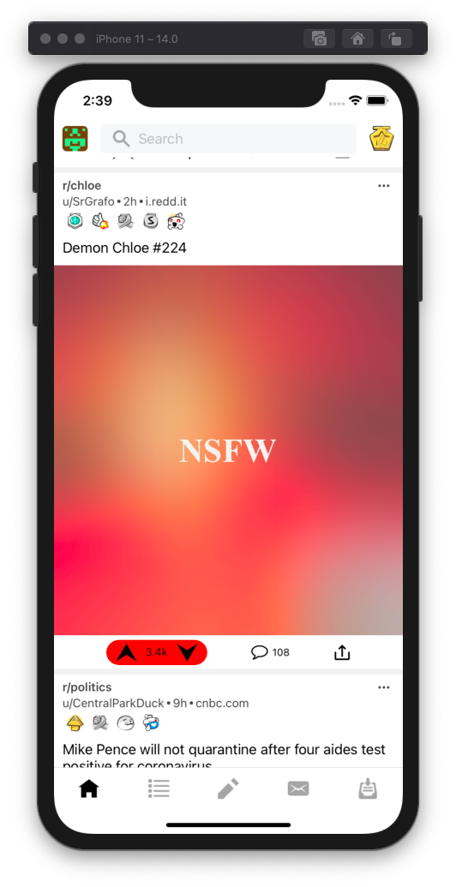

- `git clone https://github.com/React-Native-Reddit/react-native-reddit-app.git`
- `cd react-native-reddit-app`
- `npm install`
- For ios only `cd ios && pod install && cd .. && react-native run-ios`
- For android onyl `react-native run-android`

# Screenshots
<table>
  <tr>
    <td></td>
    <td></td>
    <td></td>
     <td></td>
  <tr>
  
</table>
